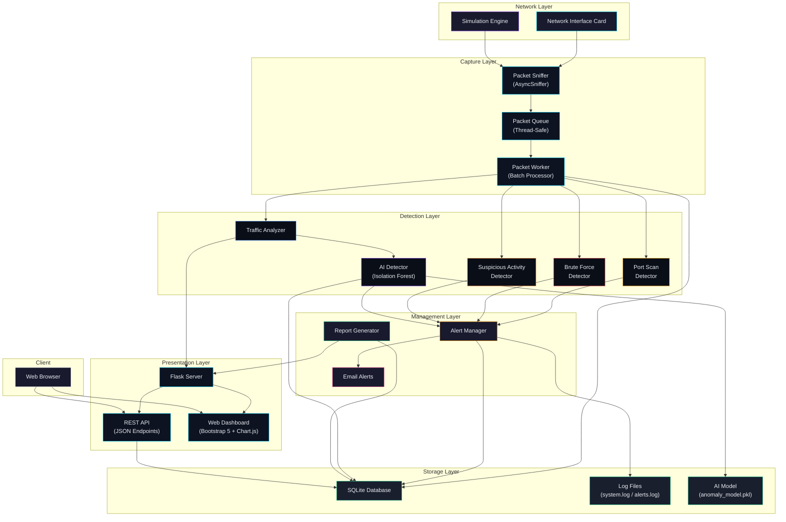

# Architecture Diagram
## NetSight System Architecture

## Layer Descriptions

| Layer | Components | Purpose |
|-------|-----------|---------|
| **Network** | NIC, Simulation Engine | Raw packet source |
| **Capture** | AsyncSniffer, Queue, Worker | Reliable packet ingestion |
| **Storage** | SQLite, Logs, Model Files | Persistent data storage |
| **Detection** | Analyzers, Detectors, AI | Threat identification |
| **Management** | Alert Manager, Reports, Email | Alert lifecycle & reporting |
| **Presentation** | Flask, API, Dashboard | User interface |
