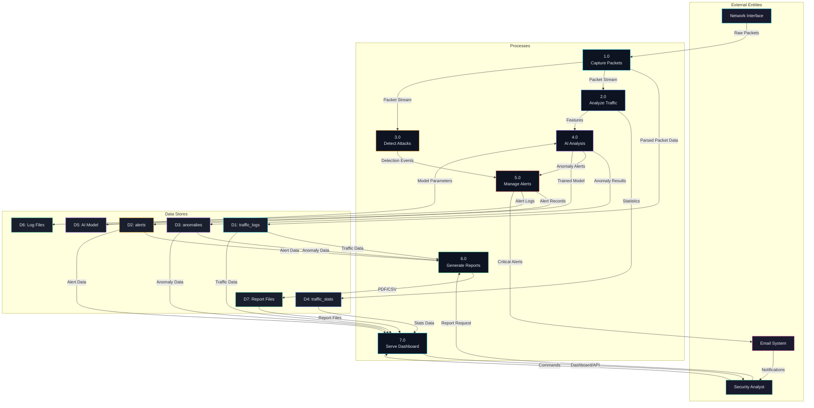

# Data Flow Diagram
## NetSight Data Flow

### Level 0 — Context Diagram

### Level 1 — Detailed Data Flow

### Data Flow Summary

| Flow | From | To | Data |
|------|------|----|------|
| 1 | Network | Packet Sniffer | Raw IP packets |
| 2 | Sniffer | Database | Parsed packet records |
| 3 | Sniffer | Analyzer | Packet stream for stats |
| 4 | Sniffer | Detectors | Packet stream for analysis |
| 5 | Analyzer | AI Engine | Feature vectors |
| 6 | Detectors | Alert Manager | Detection events |
| 7 | AI Engine | Alert Manager | Anomaly alerts |
| 8 | Alert Manager | Database | Alert records |
| 9 | Alert Manager | Email | Critical notifications |
| 10 | Database | Dashboard | Query results |
| 11 | Dashboard | User | HTML/JSON responses |
| 12 | User | Dashboard | Filter/action commands |
| 13 | Database | Report Gen | Historical data |
| 14 | Report Gen | Files | PDF/CSV reports |
