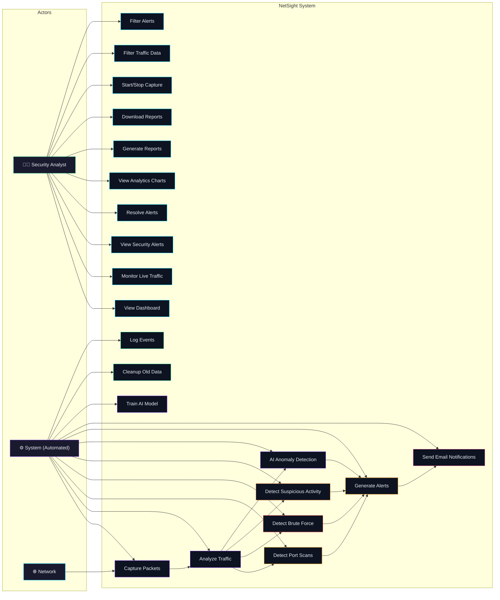

# Use Case Diagram
## NetSight Use Cases

## Use Case Descriptions

### Actor: Security Analyst (Human)

| Use Case | Description | Precondition | Postcondition |
|----------|-------------|--------------|---------------|
| UC1: View Dashboard | View real-time stats, threat score, AI status | App running | Dashboard displayed with current data |
| UC2: Monitor Live Traffic | View packet capture in real-time | Capture running | Traffic table updated every 2s |
| UC3: View Security Alerts | Browse and filter alerts by type/severity | Alerts exist | Alert list displayed |
| UC4: Resolve Alerts | Mark an alert as resolved | Alert is active | Alert status changed to resolved |
| UC5: View Analytics | Explore traffic charts and attack trends | Data collected | Charts rendered with current data |
| UC6: Generate Reports | Trigger PDF/CSV report generation | Data exists | Report files created |
| UC7: Download Reports | Download generated report files | Reports exist | File downloaded to local machine |
| UC8: Start/Stop Capture | Control packet capture engine | App running | Capture state toggled |
| UC9: Filter Traffic | Apply protocol/IP filters to traffic view | Traffic data exists | Filtered results displayed |
| UC10: Filter Alerts | Apply type/severity filters to alert view | Alerts exist | Filtered alerts displayed |

### Actor: System (Automated)

| Use Case | Description | Trigger | Postcondition |
|----------|-------------|---------|---------------|
| UC11: Capture Packets | Capture network packets continuously | Capture started | Packets stored in database |
| UC12: Analyze Traffic | Compute traffic statistics | Every 1 second | Stats updated |
| UC13: Detect Port Scans | Identify port scanning patterns | Packet received | Alert generated if scan detected |
| UC14: Detect Brute Force | Identify brute force attempts | TCP SYN to service port | Alert generated if threshold exceeded |
| UC15: Detect Suspicious | Identify anomalous traffic patterns | Every 5 seconds | Threat score updated |
| UC16: AI Detection | Run Isolation Forest prediction | Every 30 seconds | Anomaly result stored |
| UC17: Generate Alerts | Create and store security alerts | Detection event | Alert stored and logged |
| UC18: Send Emails | Notify on HIGH/CRITICAL alerts | HIGH/CRITICAL alert | Email sent to recipients |
| UC19: Train AI Model | Auto-train on baseline data | 100+ samples collected | Model saved to disk |
| UC20: Cleanup Data | Remove old records | Every 1 hour | Old records deleted |
| UC21: Log Events | Record system and alert events | Any event | Log entries written |
